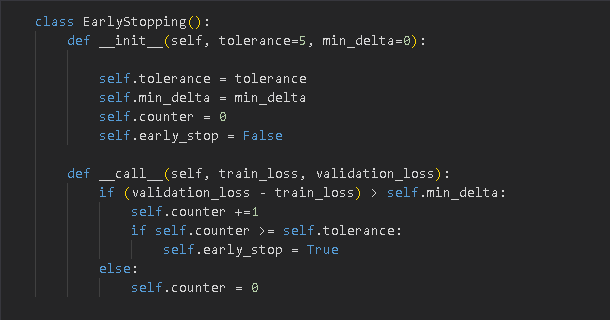
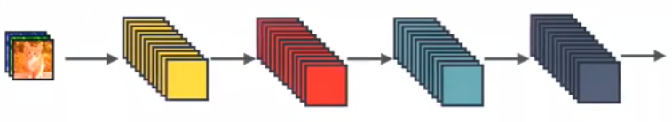
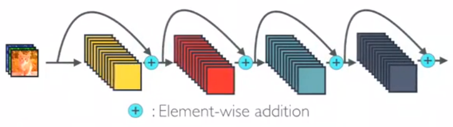
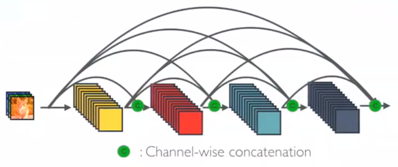

# Image_Classification_Survey

# Datasets Used

1.  Cifar10
2.  STL10
3.  Chest X-ray
4.  ImageNet-Mini

# Models trained

1.  DenseNet
2.  DLA
3.  DPN
4.  EffecientNet
5.  GoogleNet
6.  Preact Resnet
7.  ResNext

# Early stopping criteria:

The following class was used to stop training of the models:

# Comparison (Validation Accuracy Percentage)

|                   | **Cifar10** | **STL10** | **Chest X-ray** | **ImageNet Mini** |
|-------------------|-------------|-----------|-----------------|-------------------|
| **DenseNet**      | 86.56       | 63.6      | 99.65           | 44.63             |
| **DLA**           | 78.99       | 62.3      | 99.3            | 43.69             |
| **DPN**           | 84.41       | 58.6      | 99.65           | 48.17             |
| **EffecientNet**  | 85.11       | 57.6      | 99.99           | 44.08             |
| **GoogleNet**     | 83.55       | 58.8      | 99.99           | 33.94             |
| **Preact Resnet** | 83.97       | 59.78     | 99.65           | 42.72             |
| **ResNext**       | 81.87       | 61.12     | 98.94           | 46.28             |

# Why DenseNet is the SOTA model

As we can see from the table above, DenseNet is the highest scoring for STL10 and Cifar10 while also performing really well on Chest X-ray dataset. Only for ImageNet can we see DPN performing considerably better than DenseNet and we will look into that in detail.

a) DenseNet is a CNN based architecture just like many other models, but the main reason it performs so well compared to other models is because of its defining feature, the Dense blocks. To explain what that is, let’s look at the following examples:

1.  This is what a standard ConvNet looks like:

|  |
|-------------------------------------------------|

We have layers of Convolutions that obtain high-level features from the images to better classify them.

1.  This is a ResNet Model Architecture:

|  |
|-------------------------------------------------|

In Resnet models, identity mapping is proposed to promote the gradient propagation. Element-wise addition is used. It can be viewed as algorithms with a state passed from one ResNet module to another one.

1.  And finally, this is the DenseNet Architecture:

|  |
|-------------------------------------------------|

In DenseNet, each layer obtains additional inputs from all preceding layers and passes on its own feature-maps to all subsequent layers. Concatenation is used. Each layer is receiving a “collective knowledge” from all preceding layers.

Since each layer receives feature maps from all preceding layers, network can be thinner and compact, i.e., number of channels can be fewer. This gives multiple advantages such as faster training times and less overfitting, leading to better validation accuracies.

b) The reason DenseNet outperforms Inception models (GoogleNet) and DPN is because both of these models have a very high number of parameters and that often contributes to extremely inefficient training and overfitting. This on the other hand is also the reason why DPN outperforms DenseNet on ImageNet because even though DPN has more branches, its inference speed is slower than DenseNet. But on highly complex datasets like ImageNet, this complex architecture is able to learn better than simpler models like DenseNet.

Because of these reasons [DenseNet](https://arxiv.org/abs/1608.06993) won the best paper award CVPR 2017.

After 2017 however, things changed. In 2017 the paper “[Attention is all you need”](https://arxiv.org/abs/1706.03762?context=cs) was published that introduced us to the transformer architecture. After 2017 transformer-based models have been scoring the highest in almost all tasks on almost all datasets. But discussing transformers is out of scope for this report.
